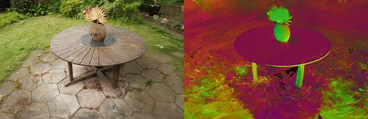

# MetalSplat

A differentiable Gaussian Splatting rasterizer for PyTorch, targeting Apple
Silicon via Metal instead of CUDA -- a `gsplat`-equivalent that runs
entirely on the MPS backend, with real hand-written Metal compute kernels
for the performance-critical stages. Two pipelines: classic **3D Gaussian
Splatting** (best novel-view quality) and **[2D Gaussian
Splatting](#2d-gaussian-splatting)** (flat oriented surfels with exact,
differentiable depth and normals, for when the geometry itself matters).


*Full-quality h264 version: [`docs/garden_orbit.mp4`](https://github.com/tchauffi/metalsplat/raw/main/docs/garden_orbit.mp4)*

The *mip-NeRF 360* garden scene, reconstructed from 185 COLMAP-posed photos
(161 train / 24 held out) and rendered on a circular orbit none of the
training cameras took. Left: RGB. Right: the depth pass -- expected depth
per pixel, produced by the same forward rasterizer in the same pass.

Trained by `examples/train_garden.py` and rendered by
`examples/render_video.py`: 15000 iterations in 42 minutes on an M-series
GPU, reaching **23.5 dB PSNR / 0.741 SSIM** on the 24 held-out views with
330k gaussians. The trained scene renders back at **93 fps** at
1297x840 (`examples/benchmark.py`).

## Requirements

- macOS on Apple Silicon (uses the `mps` PyTorch backend).
- `torch.mps.compile_shader` (present in this project's pinned torch
  version). Kernels are Metal Shading Language source compiled at *runtime*
  via PyTorch's built-in Metal compiler -- no Xcode command-line tools or
  `xcrun metal` toolchain required, no native build step.

```bash
uv sync
uv run pytest
uv run python examples/fit_image.py
```

## Usage

```python
import torch
from metalsplat import Camera, GaussianModel, render

model = GaussianModel.random(n=5000, bound=1.0, device="mps")
camera = Camera.identity(
    fx=128, fy=128, cx=64, cy=64, img_width=128, img_height=128
).to("mps")

image = render(model, camera)  # (H, W, 3), differentiable
loss = image.pow(2).mean()
loss.backward()  # gradients flow to model.means, .raw_scales, .raw_quats, .raw_opacities, .raw_colors
```

See `examples/fit_image.py` for a full training loop (Adam-optimizing
gaussians to reproduce a target image).

### Real scenes (COLMAP)

`metalsplat/data/colmap.py` loads a standard COLMAP project
(`<scene_root>/sparse/0/{cameras,images,points3D}.bin` +
`<scene_root>/images/`, via `pycolmap`) into `Camera` objects, images, and
an initial point cloud:

```python
from metalsplat.data.colmap import load_colmap_scene

scene = load_colmap_scene("data/garden", device="mps")
# scene.cameras: list[Camera], scene.images: list[Tensor], scene.points/.colors for init
```

Intrinsics are automatically rescaled if the images on disk are
downsampled relative to COLMAP's calibration resolution. Only undistorted
camera models (PINHOLE, SIMPLE_PINHOLE) are supported. See
`examples/train_garden.py` for a full training script against a real
scene: random training view per step, Adam, periodic loss/PSNR logging
against held-out eval views.

```bash
uv run python examples/train_garden.py
```

Training uses adaptive density control (`metalsplat/densify.py`): every
`DENSIFY_INTERVAL` steps, gaussians with high accumulated screen-space
gradient are split (if already large -- over-reconstruction) or cloned (if
still small -- under-reconstruction). The gradient signal used for this
is AbsGS-style (gsplat calls it `absgrad`): the rasterizer's backward
kernel atomically accumulates the *absolute value* of each pixel's
contribution to a gaussian's screen-space position, rather than relying on
`means2d.grad` (the gradient of the *summed* loss), since contributions
from different pixels can have opposite signs and cancel out there --
hiding exactly the over-reconstructed/blurry gaussians densification is
supposed to catch. Without densification, a fixed gaussian count can't add
detail where reconstruction is poor; overloaded gaussians instead
compensate by growing/recoloring in unstable ways, which shows up as
training-time color drift and falling held-out PSNR (observed empirically
on this scene before densification was added).

Loss-driven seeding (`metalsplat/seed.py`) covers what densification
alone can't: a region that starts with ~no gaussians at all (e.g. sky, or
a distant background COLMAP's sparse point cloud barely covers) has
nothing for split/clone to work with. Every `SEED_INTERVAL` steps, pixels
with high training residual and near-zero coverage (`final_T` close to 1)
get a brand-new gaussian, unprojected using a plausible borrowed depth and
bootstrapped from the ground-truth pixel color.

Opacity reset + standalone pruning (also `metalsplat/densify.py`):
`OPACITY_RESET_INTERVAL` steps, every gaussian's opacity is capped low, so
ones that only got high opacity by occluding/compensating for a neighbor
have to re-earn it through training or get removed. Pruning runs on its
own, more frequent schedule (`PRUNE_INTERVAL`) that -- unlike
densify_and_prune's split/clone -- keeps going after `DENSIFY_STOP`, so
gaussians reset late in training still get cleaned up.

The means learning rate (and, separately, the color/opacity/scale/rotation
learning rate) is decayed exponentially over training, matching standard
3DGS practice: positions (and, empirically on this scene, colors too)
should make large exploratory moves early and settle down for fine detail
late, not keep taking large steps throughout.

`SH_DEGREE` at the top of `examples/train_garden.py` selects the color
model: `0` is plain per-gaussian RGB, `1..3` is view-dependent spherical
harmonics (see below). It defaults to `3`, the 3DGS default.

The training loss (`metalsplat/losses.py`) is the standard 3DGS objective:
`(1 - lambda) * L1 + lambda * D-SSIM`, `D-SSIM = (1 - SSIM) / 2`, with the
paper's default `lambda = 0.2` (`LAMBDA_DSSIM` in the script). SSIM is a
local-window statistic computed via `conv2d` -- no custom Metal kernel
needed for it, plain torch ops already run fine on MPS here.

The trained scene is saved to a standard 3D Gaussian Splatting `.ply` file
at the end (`metalsplat.save_ply`, `metalsplat/export.py`) -- the de facto
interchange format most existing 3DGS viewers (SuperSplat, the
antimatter15/playcanvas web viewers, etc.) read directly, so a trained
scene can be viewed and reused without this package at all.

## Architecture

Pipeline: `GaussianModel + Camera -> project -> tile-bin/sort -> rasterize -> image`,
mirroring gsplat's own architecture with Metal kernels standing in for its
CUDA kernels.

- **`metalsplat/ops/project.py`** (Metal kernel, `kernels/project.metal`):
  projects 3D gaussians to 2D screen space -- camera-space transform, 3D
  covariance from scale+quaternion, the EWA/affine perspective
  approximation, and the resulting 2D conic (inverse covariance) and pixel
  radius. Forward and backward are both hand-written MSL kernels.
- **`metalsplat/ops/tiling.py`** (plain torch/MPS ops, no kernel): bins
  projected gaussians into 16x16-pixel tiles and sorts them by (tile,
  depth) via a single packed sort key -- gsplat itself doesn't use a
  custom kernel for this stage either, relying on a generic sort.
- **`metalsplat/ops/rasterize.py`** (Metal kernel, `kernels/rasterize.metal`):
  tile-based front-to-back alpha compositing. One thread per pixel, one
  threadgroup per tile. Backward accumulates per-gaussian gradients via
  Metal atomics (many pixels write to the same gaussian).
- **`metalsplat/ops/sh.py`** (Metal kernel, `kernels/sh.metal`): optional
  degree<=3 spherical-harmonics view-dependent color (`GaussianModel(...,
  sh_degree=3)`), with the active degree selectable at runtime so bands can
  be introduced progressively during training. Evaluates the SH basis given
  each gaussian's raw coefficients and its unit view direction to the
  camera (`Camera.position` gives the world-space camera center); the
  view-direction normalize
  itself is left to plain PyTorch autograd (cheap, no need for a custom
  kernel), so the Metal kernel's backward only needs to produce
  `d_sh_coeffs` and `d_dirs` -- gradient flows from there through the
  normalize op back into `model.means` automatically. Uses the standard
  3DGS color convention (`color = eval_sh(...) + 0.5`, unconstrained/
  unclamped internally) rather than the plain-RGB path's sigmoid.

Every kernel-backed stage has a pure-PyTorch reference implementation
(`metalsplat/reference/`) that is the executable spec and the numerical
oracle the kernels are tested against (`tests/test_project.py`,
`tests/test_rasterize.py`) -- both forward values and backward gradients,
via `torch.autograd` on the reference vs. the kernel's hand-written
backward. It also works as a CPU-compatible fallback.

Training-loop logic (no Metal kernels -- runs between steps, not inside
the differentiable render): `metalsplat/densify.py` (split/clone/prune,
opacity reset), `metalsplat/seed.py` (loss-driven gaussian seeding),
`metalsplat/losses.py` (L1+D-SSIM), `metalsplat/export.py` (`.ply` export).

## 2D Gaussian Splatting

A second, parallel pipeline implementing 2D Gaussian Splatting (Huang et
al. 2024, "2D Gaussian Splatting for Geometrically Accurate Radiance
Fields"). It shares this repo's tiling stage and SH color path with the
3DGS pipeline but has its own model, kernels, render entry point, losses
and densification.



*Full-quality h264 version: [`docs/garden_2dgs_orbit.mp4`](https://github.com/tchauffi/metalsplat/raw/main/docs/garden_2dgs_orbit.mp4)*

The same garden scene and the same analytic orbit as the video at the top
of this README, reconstructed with 2DGS instead. Left: RGB. Right: the
rendered surface normal, straight out of the same rasterizer pass -- not a
post-process, and not available at all from the 3DGS pipeline.

The normal pane is the one worth reading closely, because it is the whole
argument for 2DGS. Colour encodes *world-space* orientation, so a correctly
reconstructed surface holds one steady colour as the camera moves: the
table top stays flat magenta through the entire revolution, the paving
holds its own tone, and the vase shows a smooth gradient around its curve.
Where the colour boils instead -- grass, background foliage -- the geometry
genuinely isn't planar, and a flat disk is the wrong primitive for it.
That is the trade-off visible in a single frame.

Trained by `examples/train_garden_2dgs.py` and rendered by
`examples/render_video_2dgs.py`: 15000 iterations at half resolution
(`RESOLUTION_DOWNSCALE = 2.0`, the script's current default), reaching
**24.8 dB PSNR / 0.719 SSIM** on the 24 held-out views
with 812k surfels. That figure is *not* comparable to the 3DGS one at the top of this
README -- that run is at full resolution with 330k gaussians, and PSNR
rises as resolution falls, so the two differ by more than the method. No
like-for-like comparison has been run.

### Why a second pipeline

3DGS optimizes for how the scene *looks*, and its primitives are 3D
ellipsoids. That works well for novel-view synthesis but leaves the
geometry ill-defined: a 3D blob has no unambiguous surface, so "the depth
at this pixel" and "the normal at this point" are not really properties of
the model -- an ellipsoid seen from two angles disagrees with itself about
where its surface is. This is why 3DGS's depth output here is
forward-only: nothing in training constrains it to be correct.

2DGS removes the third dimension from the primitive itself. Each splat is
a flat oriented disk (a "surfel"): a position, an orientation, and *two*
tangent-plane scales `(s_u, s_v)` instead of three. A disk has an exact
intersection point with any ray and an unambiguous normal, so depth and
normals become real, differentiable, supervisable outputs rather than
byproducts. That is the whole trade: a more constrained primitive costs
some photometric quality (2DGS typically scores slightly below 3DGS on
PSNR for the same scene) and buys geometry that is consistent enough to
extract a surface from.

Use `render` (3DGS) for the best-looking novel views; use `render_2dgs`
when you care about depth, normals, or eventually a mesh.

```python
from metalsplat import Camera, Gaussian2DModel, render_2dgs
from metalsplat.losses import distortion_loss, normal_consistency_loss

model = Gaussian2DModel.random(n=5000, bound=1.0, device="mps")
camera = Camera.identity(
    fx=128, fy=128, cx=64, cy=64, img_width=128, img_height=128
).to("mps")

aux = render_2dgs(
    model, camera, return_aux=True
)  # image, depth, normal, distortion all differentiable
loss = (
    aux.image.pow(2).mean()
    + 0.01 * distortion_loss(aux.distortion)
    + 0.01 * normal_consistency_loss(aux.normal, aux.depth, 1.0 - aux.final_T, camera)
)
loss.backward()
```

`examples/fit_image_2dgs.py` is the 2DGS counterpart to `fit_image.py` --
a single-image overfit, useful as a smoke test.

### Exact ray-splat intersection

3DGS computes a pixel's alpha from an analytic 2D conic: the gaussian is
projected once per frame through a *local affine* (EWA) approximation of
the perspective transform, which is only accurate near the splat's center
and degrades for large or heavily tilted splats.

2DGS instead intersects the viewing ray with the disk's plane exactly, per
pixel. The direct form of that -- invert a matrix per pixel -- would be
far too slow, so the kernel uses the paper's reformulation: the pixel's
two ray-defining planes are pulled back into the splat's local `(u, v)`
frame, where the intersection is the cross product of two homogeneous
lines. No per-pixel inverse, no approximation. Because the local
embedding's third column is exactly zero and the projection's last two
rows are identical by construction, the whole transform collapses to **9
independent floats** per gaussian, which is what the projection stage
hands the rasterizer.

The 3DGS EWA path is still computed, but only to bound each splat's screen
footprint for tile culling, so the existing tiling stage is reused
unmodified.

### The two regularizers

Exact per-pixel depth and normals are necessary but not sufficient --
nothing yet forces them to be *mutually* consistent or spatially sharp.
2DGS adds two terms, both gated to start partway through training:

- **Depth distortion** (`distortion_loss`) concentrates each ray's weight
  at a single depth instead of smeared across many. A pixel whose
  contributing splats sit at wildly different depths is penalized in
  proportion to how far apart they are. This is the Mip-NeRF-360
  regularizer adapted to splatting, and it is what makes a depth map
  crisp at object boundaries rather than a soft blend of foreground and
  background.
- **Normal consistency** (`normal_consistency_loss`) compares the
  alpha-composited surfel normal against a *pseudo-normal* derived from
  the local gradient of the rendered depth map. Where the two disagree,
  the splats are not lying on a coherent surface. Gradient flows into both
  sides, so depth and normals converge toward agreeing with each other
  rather than one chasing a fixed target -- which is precisely the
  property a mesher needs downstream.

Both are computed on the rasterizer's own outputs: the distortion map is
accumulated inside the Metal kernel in a single front-to-back pass (with a
hand-derived closed-form backward), so the loss itself is just a
reduction.

### Training a real scene

```bash
uv run python examples/train_garden_2dgs.py
```

Same COLMAP scene and loader as the 3DGS script, starting from the 2DGS
paper's own hyperparameters (read off the reference implementation's
`OptimizationParams` and `train.py`): `lambda_dssim=0.2`,
`lambda_normal=0.05`, SH degree 3 grown one band at a time, adaptive
density control, periodic opacity reset, and the two regularizers gated to
switch on partway through training. Every one of these lives in a single
constants block at the top of the script, each annotated with the paper's
own value where it has since been tuned for this scene -- that block, not
this README, is the source of truth for what a run actually uses. Held-out
renders *and* normal maps are saved periodically, so the geometry is
inspectable during training, and the result is written as a `.ply`.

Four documented deviations, each explained at length in the script's
docstring:

- **Position learning rate** is calibrated to the scene's own point
  spacing. The paper's absolute values assume its scene-normalization
  step, which this loader doesn't apply; the *shape* of the schedule
  (log-linear decay to 1%) is unchanged.
- **Densification threshold** self-calibrates from a percentile of the
  first densification round, because this repo's AbsGS-style gradient
  signal lives on a different numeric scale than the plain gradient norm
  the paper's literal `0.0002` assumes.
- **`lambda_dist` defaults to 100**, the paper's own weight for unbounded
  scenes (1000 for bounded), rather than the reference repo's shipped
  0.0. It transfers directly because the distortion map is normalized the
  same way the official CUDA rasterizer normalizes it.
- **Iteration budget** is shortened: 15000 steps against the paper's
  30000, and densification stops at 9000 against its 15000. A budget
  choice for a laptop-scale run, not a claim about the paper -- every
  rate and weight is still the published one.

`RESOLUTION_DOWNSCALE` at the top of either training script trades detail
for speed (step time is linear in pixel count); intrinsics are rescaled
automatically.

### Module map

- **`metalsplat/gaussians_2dgs.py`** (`Gaussian2DModel`): `raw_scales` is
  `(N, 2)` -- the tangent-plane extents `(s_u, s_v)` -- with no third,
  depth-axis scale. `quat_to_rotmat`'s columns 0/1 are the disk's tangent
  axes, column 2 its surface normal (`.normals`, sign-flipped to face the
  camera at render time). Color/SH parameterization is shared with
  `GaussianModel` via `metalsplat/sh_color.py`.
- **`metalsplat/ops/project_2dgs.py`** (Metal kernel,
  `kernels/project_2dgs.metal`): reuses the exact 3DGS EWA/conic math
  (treating the missing 3rd scale as a fixed small epsilon) for the
  tile-culling bound, so `metalsplat/ops/tiling.py` is reused completely
  unmodified for tile binning. Additionally outputs the 9 independent
  entries of `M = W @ H` (the composition of the camera's projection with
  the local tangent-plane-to-world embedding) and the camera-facing
  normal, both consumed by the rasterizer's exact per-pixel intersection.
- **`metalsplat/ops/rasterize_2dgs.py`** (Metal kernel,
  `kernels/rasterize_2dgs.metal`): same tile-based front-to-back
  compositing structure as 3DGS's rasterizer, but per-pixel alpha comes
  from the ray-splat intersection described above instead of an analytic
  conic. Unlike 3DGS's forward-only depth, `depth` and `normal` here are
  genuinely differentiable, and the rasterizer also produces the per-pixel
  `distortion` map with a hand-derived closed-form backward. Gradients
  w.r.t. the projection's transform go through an implicit-function-theorem
  adjoint on the two ray-plane equations rather than differentiating the
  cross-product solve directly.
- **`metalsplat/rendering.py`** (`render_2dgs`): a separate entry point
  rather than a flag on `render()`, since `render()`'s signature carries
  3DGS-specific concepts (Mip-Splatting's `filter_3d`/`antialias`
  compensation) that don't apply here. `return_aux=True` gives
  `Render2DGSAux` with the differentiable `depth`/`normal`/`distortion`.
- **`metalsplat/losses.py`**: `distortion_loss` and
  `normal_consistency_loss` (see above). Both follow the official
  implementation's handling of accumulated alpha -- the rasterizer's depth
  and normal outputs are alpha-weighted *sums*, so the normal loss needs
  `1 - final_T` to interpret either of them.
- **`metalsplat/densify2dgs.py`**: `densify_and_prune_2dgs`/
  `prune_low_opacity_2dgs`, adaptive density control for `Gaussian2DModel`
  -- a parallel module to `metalsplat/densify.py`, differing only in
  split-offset sampling (confined to the tangent plane, since a 2D splat
  has no third axis to offset along). `reset_opacity` is reused unchanged
  from the 3DGS module.
- **`metalsplat/export2dgs.py`**: `save_ply`/`load_ply` for
  `Gaussian2DModel`, matching the official 2DGS reference implementation's
  own `.ply` layout exactly (identical to `metalsplat/export.py`'s 3DGS
  format except 2 `scale_*` properties instead of 3).

As with the 3DGS path, every kernel-backed stage has a pure-PyTorch twin
under `metalsplat/reference/` that serves as the executable spec, the CPU
fallback, and -- being plain differentiable torch -- the gradient oracle
the hand-written Metal backward passes are tested against.

### Status

Natural follow-ups, not implemented: **mesh/TSDF extraction** (the actual
payoff of 2DGS's surface accuracy -- the depth/normal/distortion outputs
all exist, but nothing consumes them into a mesh yet), Mip-Splatting's 3D
filter generalized to two scales, and a `Gaussian2DModel` equivalent of
`metalsplat/cleanup.py`'s floater pruning and view-dependence damping (the
orbit above is rendered from the raw trained model, with no cleanup pass).

## Roadmap

Deliberately out of scope for this pass:

- Multi-camera batching.
- Depth supervision (depth and alpha *are* available as auxiliary render
  outputs -- `render(..., return_aux=True)` -- but nothing trains against
  a depth prior).
- Camera lens distortion (only undistorted PINHOLE/SIMPLE_PINHOLE COLMAP
  cameras are supported).
- Mesh/TSDF extraction from the 2DGS pipeline (see its own section above).
