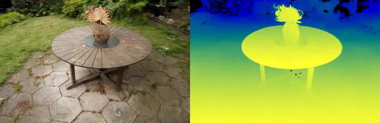

# MetalSplat

A differentiable 3D Gaussian Splatting rasterizer for PyTorch, targeting
Apple Silicon via Metal instead of CUDA -- a `gsplat`-equivalent that runs
entirely on the MPS backend, with real hand-written Metal compute kernels
for the performance-critical stages.



*Full-quality h264 version: [`docs/garden_orbit.mp4`](https://github.com/tchauffi/metalsplat/raw/main/docs/garden_orbit.mp4)*

The *mip-NeRF 360* garden scene, reconstructed from 185 COLMAP-posed photos
(161 train / 24 held out) and rendered on a circular orbit none of the
training cameras took. Left: RGB. Right: the depth pass -- expected depth
per pixel, produced by the same forward rasterizer in the same pass.

Trained by `examples/train_garden.py` and rendered by
`examples/render_video.py`: 15000 iterations in 42 minutes on an M-series
GPU, reaching **23.5 dB PSNR / 0.741 SSIM** on the 24 held-out views with
330k gaussians. The trained scene renders back at **93 fps** at
1297x840 (`examples/benchmark.py`).

## Requirements

- macOS on Apple Silicon (uses the `mps` PyTorch backend).
- `torch.mps.compile_shader` (present in this project's pinned torch
  version). Kernels are Metal Shading Language source compiled at *runtime*
  via PyTorch's built-in Metal compiler -- no Xcode command-line tools or
  `xcrun metal` toolchain required, no native build step.

```bash
uv sync
uv run pytest
uv run python examples/fit_image.py
```

## Usage

```python
import torch
from metalsplat import Camera, GaussianModel, render

model = GaussianModel.random(n=5000, bound=1.0, device="mps")
camera = Camera.identity(
    fx=128, fy=128, cx=64, cy=64, img_width=128, img_height=128
).to("mps")

image = render(model, camera)  # (H, W, 3), differentiable
loss = image.pow(2).mean()
loss.backward()  # gradients flow to model.means, .raw_scales, .raw_quats, .raw_opacities, .raw_colors
```

See `examples/fit_image.py` for a full training loop (Adam-optimizing
gaussians to reproduce a target image).

### Real scenes (COLMAP)

`metalsplat/data/colmap.py` loads a standard COLMAP project
(`<scene_root>/sparse/0/{cameras,images,points3D}.bin` +
`<scene_root>/images/`, via `pycolmap`) into `Camera` objects, images, and
an initial point cloud:

```python
from metalsplat.data.colmap import load_colmap_scene

scene = load_colmap_scene("data/garden", device="mps")
# scene.cameras: list[Camera], scene.images: list[Tensor], scene.points/.colors for init
```

Intrinsics are automatically rescaled if the images on disk are
downsampled relative to COLMAP's calibration resolution. Only undistorted
camera models (PINHOLE, SIMPLE_PINHOLE) are supported. See
`examples/train_garden.py` for a full training script against a real
scene: random training view per step, Adam, periodic loss/PSNR logging
against held-out eval views.

```bash
uv run python examples/train_garden.py
```

Training uses adaptive density control (`metalsplat/densify.py`): every
`DENSIFY_INTERVAL` steps, gaussians with high accumulated screen-space
gradient are split (if already large -- over-reconstruction) or cloned (if
still small -- under-reconstruction). The gradient signal used for this
is AbsGS-style (gsplat calls it `absgrad`): the rasterizer's backward
kernel atomically accumulates the *absolute value* of each pixel's
contribution to a gaussian's screen-space position, rather than relying on
`means2d.grad` (the gradient of the *summed* loss), since contributions
from different pixels can have opposite signs and cancel out there --
hiding exactly the over-reconstructed/blurry gaussians densification is
supposed to catch. Without densification, a fixed gaussian count can't add
detail where reconstruction is poor; overloaded gaussians instead
compensate by growing/recoloring in unstable ways, which shows up as
training-time color drift and falling held-out PSNR (observed empirically
on this scene before densification was added).

Loss-driven seeding (`metalsplat/seed.py`) covers what densification
alone can't: a region that starts with ~no gaussians at all (e.g. sky, or
a distant background COLMAP's sparse point cloud barely covers) has
nothing for split/clone to work with. Every `SEED_INTERVAL` steps, pixels
with high training residual and near-zero coverage (`final_T` close to 1)
get a brand-new gaussian, unprojected using a plausible borrowed depth and
bootstrapped from the ground-truth pixel color.

Opacity reset + standalone pruning (also `metalsplat/densify.py`):
`OPACITY_RESET_INTERVAL` steps, every gaussian's opacity is capped low, so
ones that only got high opacity by occluding/compensating for a neighbor
have to re-earn it through training or get removed. Pruning runs on its
own, more frequent schedule (`PRUNE_INTERVAL`) that -- unlike
densify_and_prune's split/clone -- keeps going after `DENSIFY_STOP`, so
gaussians reset late in training still get cleaned up.

The means learning rate (and, separately, the color/opacity/scale/rotation
learning rate) is decayed exponentially over training, matching standard
3DGS practice: positions (and, empirically on this scene, colors too)
should make large exploratory moves early and settle down for fine detail
late, not keep taking large steps throughout.

Set `SH_DEGREE = 2` at the top of `examples/train_garden.py` to train
view-dependent color (see below) instead of the default plain RGB.

The training loss (`metalsplat/losses.py`) is the standard 3DGS objective:
`(1 - lambda) * L1 + lambda * D-SSIM`, `D-SSIM = (1 - SSIM) / 2`, with the
paper's default `lambda = 0.2` (`LAMBDA_DSSIM` in the script). SSIM is a
local-window statistic computed via `conv2d` -- no custom Metal kernel
needed for it, plain torch ops already run fine on MPS here.

The trained scene is saved to a standard 3D Gaussian Splatting `.ply` file
at the end (`metalsplat.save_ply`, `metalsplat/export.py`) -- the de facto
interchange format most existing 3DGS viewers (SuperSplat, the
antimatter15/playcanvas web viewers, etc.) read directly, so a trained
scene can be viewed and reused without this package at all.

## Architecture

Pipeline: `GaussianModel + Camera -> project -> tile-bin/sort -> rasterize -> image`,
mirroring gsplat's own architecture with Metal kernels standing in for its
CUDA kernels.

- **`metalsplat/ops/project.py`** (Metal kernel, `kernels/project.metal`):
  projects 3D gaussians to 2D screen space -- camera-space transform, 3D
  covariance from scale+quaternion, the EWA/affine perspective
  approximation, and the resulting 2D conic (inverse covariance) and pixel
  radius. Forward and backward are both hand-written MSL kernels.
- **`metalsplat/ops/tiling.py`** (plain torch/MPS ops, no kernel): bins
  projected gaussians into 16x16-pixel tiles and sorts them by (tile,
  depth) via a single packed sort key -- gsplat itself doesn't use a
  custom kernel for this stage either, relying on a generic sort.
- **`metalsplat/ops/rasterize.py`** (Metal kernel, `kernels/rasterize.metal`):
  tile-based front-to-back alpha compositing. One thread per pixel, one
  threadgroup per tile. Backward accumulates per-gaussian gradients via
  Metal atomics (many pixels write to the same gaussian).
- **`metalsplat/ops/sh.py`** (Metal kernel, `kernels/sh.metal`): optional
  degree<=2 spherical-harmonics view-dependent color (`GaussianModel(...,
  sh_degree=2)`). Evaluates the SH basis given each gaussian's raw
  coefficients and its unit view direction to the camera (`Camera.position`
  gives the world-space camera center); the view-direction normalize
  itself is left to plain PyTorch autograd (cheap, no need for a custom
  kernel), so the Metal kernel's backward only needs to produce
  `d_sh_coeffs` and `d_dirs` -- gradient flows from there through the
  normalize op back into `model.means` automatically. Uses the standard
  3DGS color convention (`color = eval_sh(...) + 0.5`, unconstrained/
  unclamped internally) rather than the plain-RGB path's sigmoid.

Every kernel-backed stage has a pure-PyTorch reference implementation
(`metalsplat/reference/`) that is the executable spec and the numerical
oracle the kernels are tested against (`tests/test_project.py`,
`tests/test_rasterize.py`) -- both forward values and backward gradients,
via `torch.autograd` on the reference vs. the kernel's hand-written
backward. It also works as a CPU-compatible fallback.

Training-loop logic (no Metal kernels -- runs between steps, not inside
the differentiable render): `metalsplat/densify.py` (split/clone/prune,
opacity reset), `metalsplat/seed.py` (loss-driven gaussian seeding),
`metalsplat/losses.py` (L1+D-SSIM), `metalsplat/export.py` (`.ply` export).

## 2D Gaussian Splatting

A second, parallel pipeline implementing 2D Gaussian Splatting (Huang et
al. 2024, "2D Gaussian Splatting for Geometrically Accurate Radiance
Fields"): each splat is a flat, oriented disk (a "surfel") in world space
-- a position, an orientation, and two tangent-plane scales -- rasterized
via an *exact* per-pixel ray-splat intersection rather than 3DGS's
local-affine (EWA) approximation, giving more accurate depth and normals.

```python
from metalsplat import Camera, Gaussian2DModel, render_2dgs
from metalsplat.losses import distortion_loss, normal_consistency_loss

model = Gaussian2DModel.random(n=5000, bound=1.0, device="mps")
camera = Camera.identity(
    fx=128, fy=128, cx=64, cy=64, img_width=128, img_height=128
).to("mps")

aux = render_2dgs(
    model, camera, return_aux=True
)  # image, depth, normal, distortion all differentiable
loss = (
    aux.image.pow(2).mean()
    + 0.01 * distortion_loss(aux.distortion)
    + 0.01 * normal_consistency_loss(aux.normal, aux.depth, camera)
)
loss.backward()
```

- **`metalsplat/gaussians_2dgs.py`** (`Gaussian2DModel`): `raw_scales` is
  `(N, 2)` -- the tangent-plane extents `(s_u, s_v)` -- with no third,
  depth-axis scale. `quat_to_rotmat`'s columns 0/1 are the disk's tangent
  axes, column 2 its surface normal (`.normals`, sign-flipped to face the
  camera at render time). Color/SH parameterization is shared with
  `GaussianModel` via `metalsplat/sh_color.py`.
- **`metalsplat/ops/project_2dgs.py`** (Metal kernel,
  `kernels/project_2dgs.metal`): reuses the exact 3DGS EWA/conic math
  (treating the missing 3rd scale as a fixed small epsilon) for the
  tile-culling bound, so `metalsplat/ops/tiling.py` is reused completely
  unmodified for tile binning. Additionally outputs the 9 independent
  entries of `M = W @ H` (the composition of the camera's projection with
  the local tangent-plane-to-world embedding) and the camera-facing
  normal, both consumed by the rasterizer's exact per-pixel intersection.
- **`metalsplat/ops/rasterize_2dgs.py`** (Metal kernel,
  `kernels/rasterize_2dgs.metal`): same tile-based front-to-back
  compositing structure as 3DGS's rasterizer, but per-pixel alpha comes
  from resolving the ray-splat intersection (a homogeneous-plane pullback
  and cross product, no per-pixel matrix inverse) instead of an analytic
  conic. Unlike 3DGS's forward-only depth, `depth` and `normal` here are
  genuinely differentiable, and the rasterizer also produces a per-pixel
  `distortion` map (the Mip-NeRF-360/2DGS "concentrate the weight along
  the ray" regularizer) with a hand-derived closed-form backward.
- **`metalsplat/losses.py`**: `distortion_loss` (a reduction over the
  rasterizer's distortion map) and `normal_consistency_loss` (compares the
  rendered normal against a pseudo-normal derived from the depth map's
  local shape, teaching depth and normals to agree).

Out of scope for this pass (natural follow-ups): mesh/TSDF extraction,
`.ply` export/import for 2DGS models, Mip-Splatting's 3D filter and
adaptive densification generalized to 2 scales.

## Roadmap

Deliberately out of scope for this pass:

- SH degree 3 (only degree<=2, 9 coefficients/channel, is implemented; the
  kernel pattern extends directly, just more basis-function terms).
- Exact anti-aliasing compensation factor (currently a small `eps * I`
  regularizer on the 2D covariance for numerical stability instead).
- Multi-camera batching.
- Depth/alpha auxiliary render outputs and depth supervision.
- Camera lens distortion (only undistorted PINHOLE/SIMPLE_PINHOLE COLMAP
  cameras are supported).
- `.ply` import (`metalsplat.export.save_ply` only exports; loading a
  `.ply` back into a `GaussianModel` isn't implemented).
